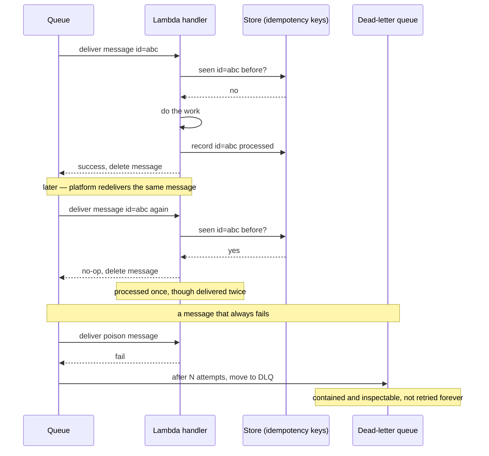

# The four shapes and the at-least-once retry path

Two diagrams: the four blueprints side by side, and the redelivery path that every asynchronous handler
must survive.

## The four workload shapes

Each blueprint is a distinct control-and-data shape on AWS. Match the shape to the workload
([the catalogue](../blueprints)); all four share the same four serverless truths ([the ADRs](../adr)).

```mermaid
graph TB
    subgraph b1["Synchronous API — a client waits"]
        c1["client"] --> ag["API Gateway"] --> l1["Lambda"] --> st1["store"]
        l1 --> resp["response"]
    end

    subgraph b2["Asynchronous fan-out — work after the response"]
        p2["producer"] --> ev["EventBridge / SNS"] --> q["SQS queue"] --> l2["Lambda"]
        q -->|"repeated failure"| dlq["dead-letter queue"]
        l2 --> st2["store"]
    end

    subgraph b3["Orchestrated workflow — multi-step with state"]
        t3["trigger"] --> sf["Step Functions"]
        sf --> sa["step A"]
        sf --> sb["step B"]
        sf --> sc["step C"]
    end

    subgraph b4["Scheduled / batch — work on a clock"]
        sch["EventBridge Scheduler"] --> l4["Lambda"] --> ds["dataset"]
        l4 -->|"too large for one run"| fan["fan out to async"]
    end

    classDef node fill:#438dd5,stroke:#2e6295,color:#fff
    classDef store fill:#08427b,stroke:#052e56,color:#fff
    classDef warn fill:#c0392b,stroke:#7b241c,color:#fff
    class c1,ag,l1,p2,ev,q,l2,t3,sf,sa,sb,sc,sch,l4,fan node
    class st1,st2,ds,resp store
    class dlq warn
```

The shapes differ in what decides flow — a request, a buffered event, an orchestrator, a clock — but
none escapes the four truths: state in a store ([ADR-0002](../adr/0002-stateless-ephemeral.md)),
at-least-once handling ([ADR-0003](../adr/0003-at-least-once.md)), a cold-start/concurrency plan
([ADR-0004](../adr/0004-cold-start-and-concurrency.md)), and one least-privilege role each
([ADR-0005](../adr/0005-least-privilege-per-function.md)).

## Surviving redelivery — the truth most often violated

The platform delivers at least once. This is the path a handler must be correct on: the same message,
seen twice ([ADR-0003](../adr/0003-at-least-once.md)).

The two halves are the whole discipline: an **idempotency key** in the store
([ADR-0002](../adr/0002-stateless-ephemeral.md)) makes a redelivery a safe no-op, and a **dead-letter
queue** catches a poison message after bounded retries so it stops wasting the consumer. Skip either and
at-least-once delivery turns into double-processing or an infinite retry loop
([ADR-0003](../adr/0003-at-least-once.md)).
